# 超音波風速計を作る

超音波距離計を使って風速を測ります。

音は風に逆らって進むと遅くなるし、追い風に乗ると速くなるので、決まった距離を音が到達する時間を測って風速を求めることができます。

今回使った超音波距離計は US-025 ってやつです。精度は 1㎜ まで計測可能。有名な超音波距離計には HC-SR04 っていうのがあるのですが、こっちの精度は 3㎜ なのでちょっときついかと思います。

普通の超音波距離計の使い方は左。壁とかに音を飛ばして、反射して戻ってくるまでの時間から距離を計算します。

今回は右のように改造して使います。原理は[超音波風向風速計測定原理](https://prede.com/betu-tyou.html)に書いてある通りです。

[改造過程の写真](https://twitter.com/tom01_h/status/1394987244050599940) です。

